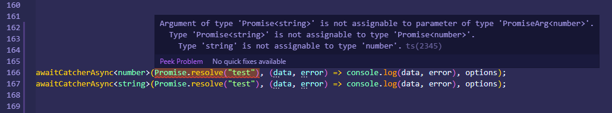

<p>
  <a aria-label="await-catcher" href="https://www.npmjs.com/package/await-catcher">
    
  </a>
 
 <a align="right" aria-label="await-catcher" href="https://github.com/canaanites/await-catcher/blob/master/LICENSE" target="_blank">
    
  </a>
</p>

<h1 align="center">await-catcher 🔥</h1>

<p align="center">
  <b>Promise wrapper for easy error handling without try-catch</b>
</p>

<p align="center">
  <a align="center" aria-label="Well tested await-catch Library" href="https://github.com/canaanites/await-catcher/actions">
    
  </a>
</p>

<br>

<p>
  

  <a align="right" aria-label="NPM await-catcher" href="https://www.npmjs.com/package/await-catcher" target="_blank">
    
  </a>
<!--- 
  <a aria-label="" href="">
    
  </a>
--->
</p>
<br>

<!---
# await-catcher
[![NPM version][npm-image]][npm-url]
[![Downloads][download-image]][npm-url]
[![Actions Status][actions-image]][actions-url]
--->


## Installation
[](https://nodei.co/npm/await-catcher/)
```bash
npm i await-catcher --save
```
<br>

## Usage
Import the library into your JavaScript file:

```js
import { awaitCatcher, awaitCatcherAsync } from 'await-catcher';
```
<br>

## Examples
<b>await-catcher benefits:</b>

 1) Type checking with typeScript generics
 2) Cleaner & less code (no need for try/catch)
 3) Dynamic variable names, accepts all data types, and more...
 4) Use awaitCatcherAsync to pass a call-back instead of using await/async (see below screenshot)


.

### #1
```js
/** 
 *  #1 - Type checking with typeScript generics 
 * 
 *  Notice how the types are being passed. await-catcher uses generics to validate the types
 *  If a type doesn't match the returned value, then await-catcher will return a type error at runtime and compile time!
 */
interface Type_1 {
     test: string
 }

let promise = Promise.resolve({test: "hi mom"})
let [ data , error ] = await awaitCatcher<Type_1>(promise);
console.log(data, error); // "hi mom, undefined 


type Type_2 = Array<number>;

let array = [123, 321];
let [ data , error ] = await awaitCatcher<Type_2>(array);
console.log(data, error); // "[123, 321], undefined 

let array2 = [123, "string"];
let [ data , error ] = await awaitCatcher<Type_2>(array2); 
console.log(data, error); // undefined, Type error: Type 'string' is not assignable to type 'number'

```

### #2
```js
/** 
 *  #2 - Cleaner and less code
 *
 *  Makes the code easier to read by eliminating the need to use try/catch
 */

// 👎 old way of doing things...
const confirmUserEmailById = async (userId) => {
    const userData; 
    try {
      userData = await UserModel.findById(userId);
    } catch (err) {
      console.log(err)
    }

    if (!data) {
      return;
    }

    const ticketId; 
    try {
      ticketId = await sendEmailTo(userData.email);
    } catch (err) {
      console.log(err)
    }

    if (!ticketId) {
      return;
    }

    return `Confirmation has been sent to ${userData.email} successfully. The support ticket number is ${ticketId}`;
} 

// 🔥 Now you can do it like this...

const confirmUserEmailById = async (userId) => {
    const [ userData, userError ] = await awaitCatcher( UserModel.findById(userId) );
    if (!userData || userError) return console.log(userError);

    const [ ticketId, ticketError] = await awaitCatcher( sendEmailTo(userData.email) );
    if (!ticketId || ticketError return console.log(ticketError);

    return `Confirmation has been sent to ${userData.email} successfully. The support ticket number is ${ticketId}`;

}
```

### #3
```js
/** 
 *  #3 - Dynamic variables names
 *
 *  awaitCatcher returns an array of [ data, error ] like this --> Either [ undefined, error ] or [ data, undefined ].
 *
 *  Therefore, you can utilize the array destructuring feature in ES6 to name the returned value whatever you like.
 * 
 *  The below 3 examples demonstrate some of the data types that awaitCatcher() can handle
 */
 
// 1)
let data, error;
[ data, error ] = await awaitCatcher("I can pass anything to awaitCatcher :)");
console.log(data, error); // "I can pass anything to awaitCatcher", undefined


// 2)
// notice we are reusing the same varibleables (data & error) that were declared above
[ data, error ] = await awaitCatcher(Promise.reject("I don't need try/catch to handle rejected promises"))
console.log(data, error); // undefined, "I don't need try/catch to handle rejected promises"


// 3)
// other variable names can be used whenever needed
const [ anyVarName_data, anyVarName_error ] = await awaitCatcher( () => Promise.resolve("I can pass functions that return promises") )
console.log(anyVarName_data, anyVarName_error); // "I can pass functions that return promises", undefined

```

### #4
```js
/** 
 *  #4 - Use awaitCatcherAsync to pass a call-back instead of using await/async
 *  
 *  This is useful when you're not in an async function, but you still can use await-catcher
 */
```


```js
/**
 * awaitCatcherAsync is a wrapper for awaitCatcher that accepts a callback instead of aysnc/await
 * @param promise 
 * @param cb 
 * @param options 
 */

awaitCatcherAsync<Array<string>>(
    callToGetData(), 
    (data, error) => this.setState({updateScreenData: data}), 
    options 
  );
```

### Options
```js
  type options = {
      getByKeys?: String[]; // get key/values from object
      getByKeysAndInvoke?: String[]; // get key/values from object and invoke functions
  }
```
<br>

#### 🙏 Thanks to
[Evan Bacon](https://github.com/EvanBacon), a great "markdown developer". (I stole this readme layout from him! 😁)


[npm-url]: https://www.npmjs.com/package/await-catcher
[npm-image]: https://img.shields.io/npm/v/await-catcher.svg?style=flat-square

[travis-url]: https://travis-ci.org/scopsy/await-catcher
[travis-image]: https://img.shields.io/travis/scopsy/await-catcher.svg?style=flat-square

[coveralls-url]: https://coveralls.io/r/scopsy/await-catcher
[coveralls-image]: https://img.shields.io/coveralls/scopsy/await-catcher.svg?style=flat-square

[depstat-url]: https://david-dm.org/scopsy/await-catcher
[depstat-image]: https://david-dm.org/scopsy/await-catcher.svg?style=flat-square

[download-image]: http://img.shields.io/npm/dm/await-catcher.svg?style=flat-square

[actions-image]: https://github.com/canaanites/await-catcher/workflows/Test%20await%20catcher/badge.svg
[actions-url]: https://github.com/canaanites/await-catcher/actions
